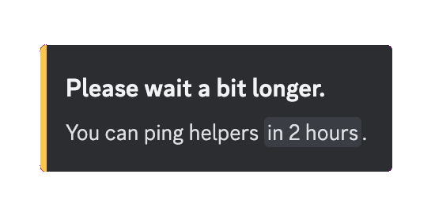
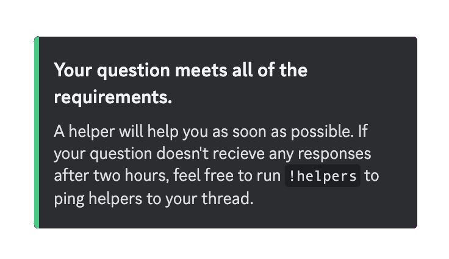

# discord-forum-bot

## Features

-   🏷️ Open/resolved tag status management.

    |  |  |
    | ------------------------- | ----------------------------- |

-   🚨 Helper ping system.

    |  |  |
    | ------------------------------------- | ----------------------------------- |

-   🗒️ Enforce requirements.

    |  |
    | --------------------------------------- |

-   🔗 Expand GitHub file links into code block embeds.

    |  |
    | --------------------------------- |

## License

[AGPL-3.0](LICENSE)
